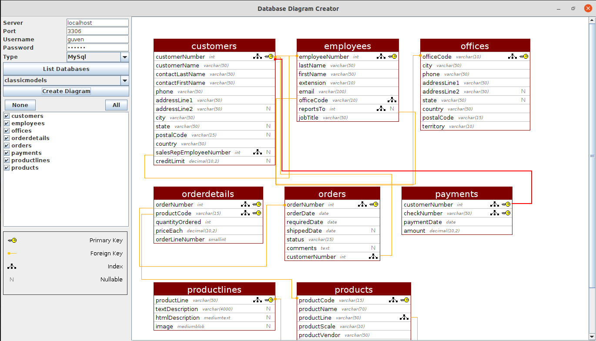

# Database Diagram Creator
* A Java Swing application that creates database diagrams. 

* MySQL and MSSQL.

### Screenshots

### Requirements
* Java version 8 or higher.

### Installation
* There are only MSSQL driver for Windows and MySQL driver for Linux in the lib folder. 
You should add the necessary JDBC driver jar in other cases.

### Contributing
* If you want to contribute to this project your pull request is very welcomed.
* If you find any issue just put it in the repository issue section, thank you.
